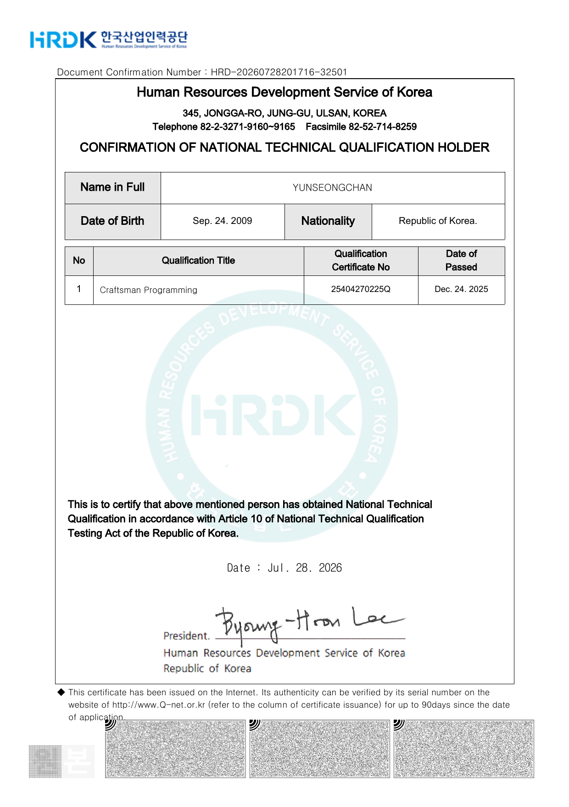

# Craftsman Information Processing (정보처리기능사)

> **Note:** As of January 2026, this national qualification was renamed **Craftsman Programming (프로그래밍기능사)**, its written subjects were restructured, and the practical exam changed from a written format to a hands-on coding test. I hold this certification under its previous designation.

| Item | Details |
|---|---|
| **Certification** | Craftsman Information Processing (정보처리기능사) |
| **Issuing authority** | Human Resources Development Service of Korea (HRDK) |
| **Type** | National technical qualification — entry level |
| **Earned** | 2025-12-24 |
| **Credential ID** | `25404270225Q` |
| **Verification** | [Q-Net](https://www.q-net.or.kr) — Korea's official national technical qualification portal |
| **Validity** | 2 years |

---

## TL;DR

A national technical qualification certifying foundational competency in software development, database handling, operating systems, and data communications. For me it was the entry point into IT — I went from no formal background at all to a verified baseline, and much of what it covers is what I now rely on to understand *why* an attack works rather than just *that* it works.

---

## Context for non-Korean readers

A government-issued entry-level IT qualification in South Korea, administered by HRDK and verifiable through the national Q-Net portal. It is not security-specific — it certifies baseline technical competence across programming, databases, operating systems, and networking.

Broadly comparable in scope to an AQF Certificate III–IV level IT qualification in Australia. *(Informal comparison for context only — this is not an official AQF skills assessment.)*

---

## What it covers

**Written exam — 4 subjects**

| Subject | Scope |
|---|---|
| Computer fundamentals | Hardware and basic system architecture |
| Package utilisation | Database and spreadsheet fundamentals |
| PC operating systems | Windows and Unix/Linux structure and administration |
| Data communications | Network protocols and data transmission |

**Format.** 60 multiple-choice questions (four options each) in 60 minutes, delivered
as a computer-based test with the result shown immediately on completion. Pass mark is
60 out of 100 — 36 correct answers — with no per-subject minimum.

**Practical exam**

**Format.** A 90-minute written-response paper on information processing practice,
covering programming logic, database design, and system concepts. Pass mark is 60 out
of 100. This is historically the harder of the two stages — the national pass rate for
the practical sits well below the written stage.

**Curriculum change (from 2026)**

The qualification now runs as *Craftsman Programming* with restructured written subjects (programming languages, application software fundamentals, SQL, information system fundamentals) and a practical exam delivered as a coding test.

---

## How it connects to offensive security

| Core competency | Relevance to security work |
|---|---|
| **Programming & scripting** | Understanding loops, conditionals, data structures, and memory handling in Python, Java, and C is what lets me read exploit code instead of copy-pasting it, audit source during code review, and write my own payloads and automation. |
| **SQL & relational databases** | Knowing how queries are constructed and parsed is the reason SQL injection makes sense to me structurally — where the parser breaks, why a payload terminates a string, and how to reason about blind and time-based variants. |
| **Operating system internals** | Process models, file permissions, and Linux/Unix directory structure are the foundation of privilege escalation enumeration. Knowing what a normal system looks like is what makes an abnormal one visible. |
| **Networking & protocols** | OSI layers, TCP/IP behaviour, and subnetting feed directly into reconnaissance — interpreting Nmap output, inferring network topology, and identifying which services are worth attacking. |
| **System architecture** | Basic hardware and memory concepts became the groundwork for later work in binary exploitation and reverse engineering. |

---

## Preparation

[📅 View study plan](assets/study-plan.png)

| Metric | Detail |
|---|---|
| **Total duration** | 4 months — 2 months written, 2 months practical |
| **Daily commitment** | ~3 hours per day, sustained through the school term |
| **Study materials** | *Sinagong* (시나공) — standard Korean IT certification textbook series |
| **Method** | Official curriculum first, then mock exams and exam-blueprint analysis to target weak subjects |
| **Attempts** | Passed both stages on the first attempt |

**Starting point:** effectively zero formal IT knowledge — I began by learning what an IP address is. Reaching a verified qualification in four months of self-directed study is the part of this certification I actually consider meaningful.Both certifications were completed within two weeks of each other — Network Administrator
Level 2 on 9 December 2025, this one on 24 December.

---

## What I still use

- **Network and subnet architecture** — IP routing, OSI layer behaviour, and data transmission concepts are used constantly when scanning network topologies and mapping target assets.
- **SQL query structure** — the mental model of how a query is built and parsed is what I fall back on when constructing and adapting injection payloads.
- **Linux and OS fundamentals** — permission models, processes, and filesystem layout underpin the privilege escalation enumeration I do in almost every lab.