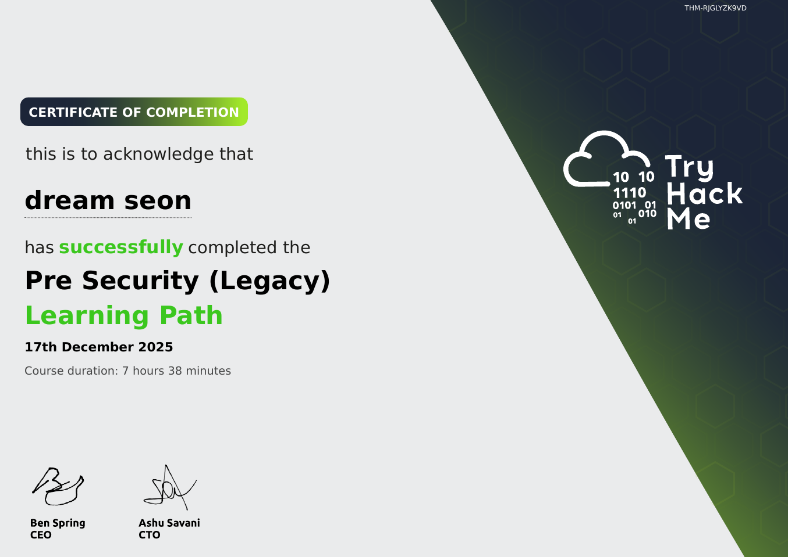
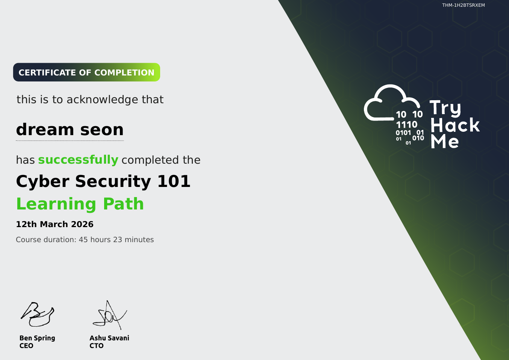
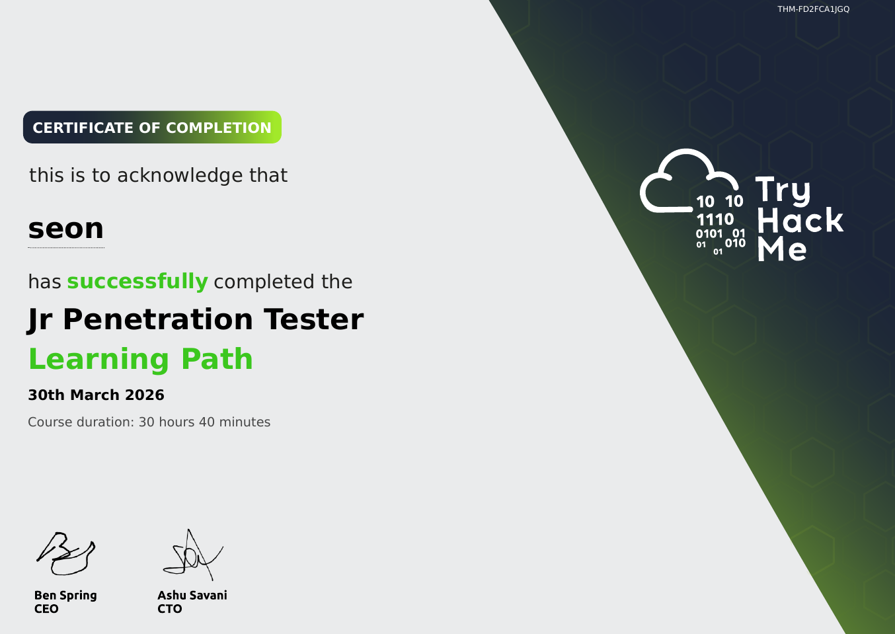
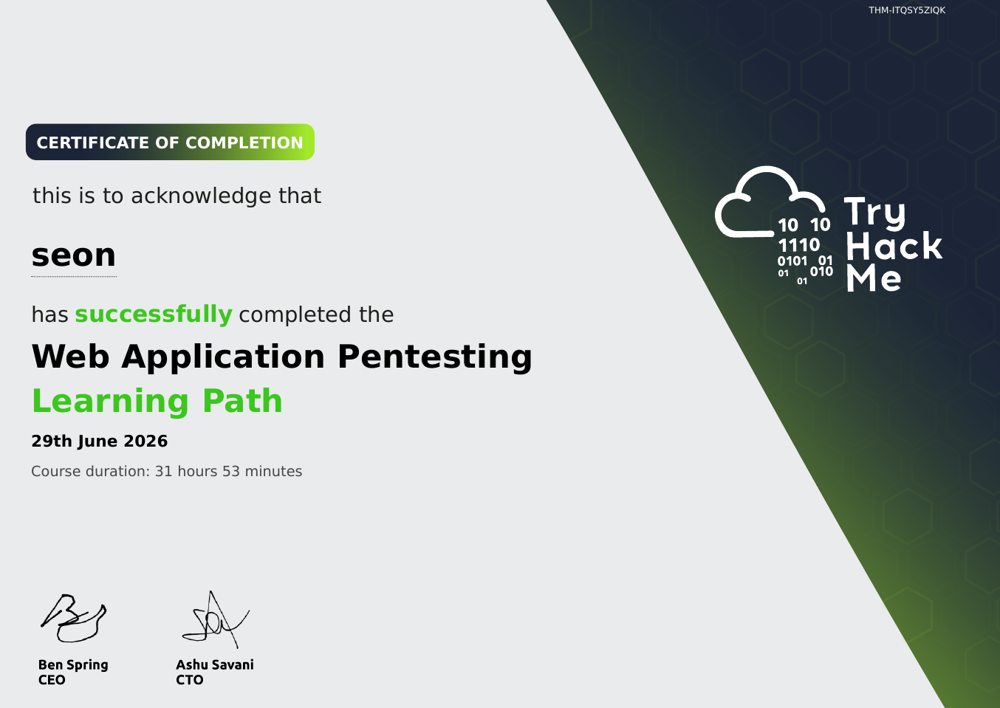
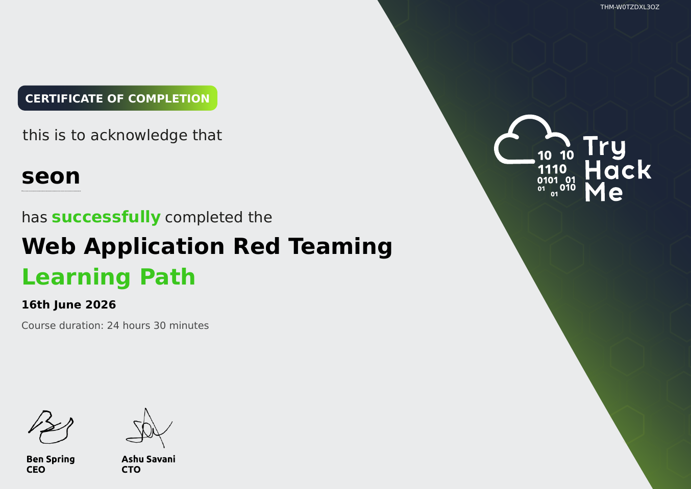
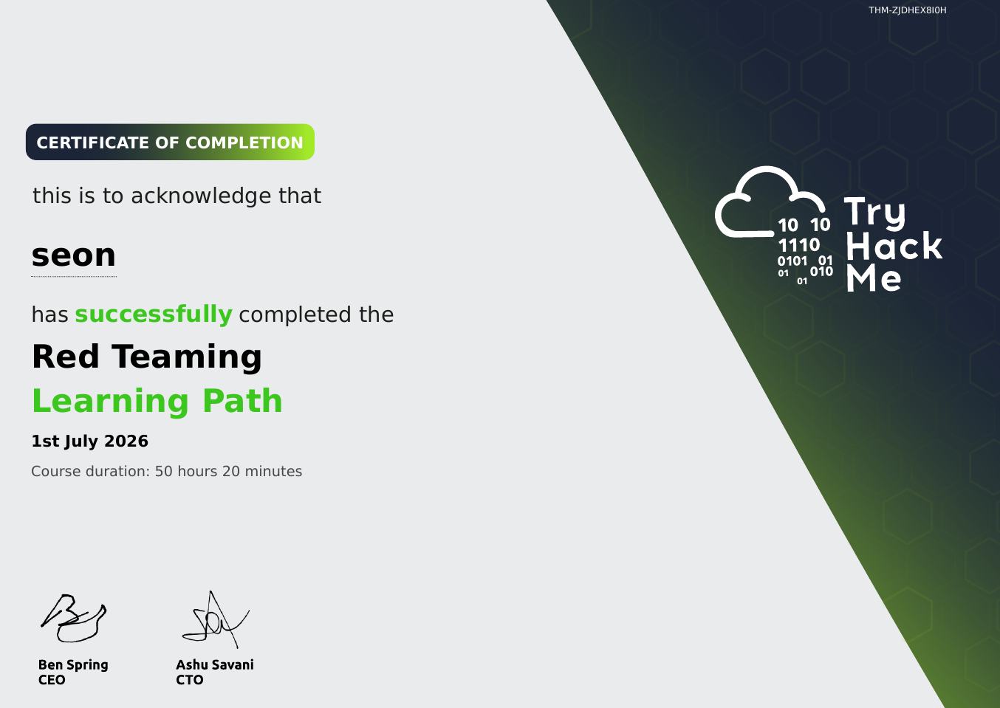

# TryHackMe

Structured, hands-on learning paths completed on TryHackMe, listed in the order I
completed them. These are training completions rather than examined certifications —
kept separate from [certifications](../../certifications/) for that reason.

**Profile:** [tryhackme.com/p/seon092424](https://tryhackme.com/p/seon092424) — top 1% of users globally and a peak rank of #13 in South Korea (all-time), as of July 2026

---

## Paths completed

<!--
  Certificate 열: THM에서 각 패스 → Share 버튼 → 링크 복사 → <url> 자리에 붙여넣기
-->

| # | Path | Difficulty | Period |
|---|---|---|---|
| 1 | Pre Security | Easy | 2025-12-01 → 2025-12-17 |
| 2 | Cyber Security 101 | Easy | 2026-01-01 → 2026-03-12 |
| 3 | Jr Penetration Tester | Medium | 2026-03-13 → 2026-03-30 |
| 4 | Web Application Pentesting | Medium | 2026-04-01 → 2026-06-29 |
| 5 | Web Application Red Teaming | Hard | 2026-04-01 → 2026-06-16 |
| 6 | Red Teaming | Hard | 2026-06-17 → 2026-07-01 |

**Total:** 6 learning paths completed between December 2025 and July 2026, reaching the top 1% of users globally.

---

## What this progression represents

The early paths built the groundwork. Pre Security and Cyber Security 101 covered
networking, Linux, and core security concepts; Jr Penetration Tester then tied those
threads into a full end-to-end penetration test — enumeration, exploitation, and
privilege escalation in sequence rather than in isolation.

From April 2026 the work specialised and ran on two tracks at once. Web Application
Pentesting and Web Application Red Teaming went deep on the web attack surface from
both the tester's and the operator's perspective, run in parallel over the same three
months. That fed directly into the Red Teaming path — adversary tradecraft across the
full attack chain: initial access, host and network evasion, Active Directory
compromise, and persistence.

Completing the Red Teaming path on 1 July 2026 closed out six paths in roughly seven
months of self-directed study, at which point I had reached the top 1% of users on the
platform.

---

## Certificates

View certificates

 

